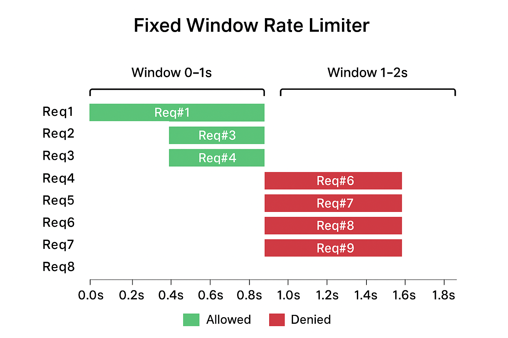
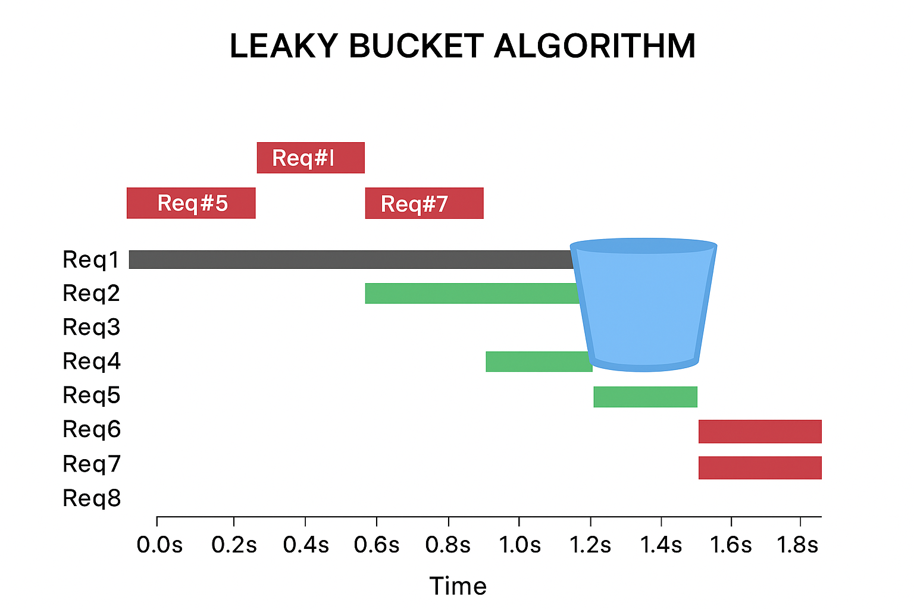

# 1️⃣ **TOKEN-BUCKET ALGORITHM** 🪣


```go 
package main

import (
	"fmt"
	"time"
)

// "Token Bucket Algorithm" implementation ⚡
// Why struct{}{} ? - No memory-overhead with an empty struct{} (0 bytes) 💡

type RateLimiter struct {
	tokens     chan struct{}
	refillTime time.Duration
}

 func NewRateLimiter(rateLimit int, refillTime time.Duration) *RateLimiter{
	rl:= &RateLimiter{
	tokens: make(chan struct{}, rateLimit),
	refillTime: refillTime,
}
	for range rateLimit{
	rl.tokens <- struct{}{}
}
	go rl.startRefill() // goroutine running in the BG.
	return  rl
 }

 func (rl *RateLimiter) startRefill(){
	ticker:= time.NewTicker(rl.refillTime)
	defer ticker.Stop()
	for {
		select {
		case <-ticker.C:
			select {
			case rl.tokens <-struct{}{}:
			default:
			}
		}
	}
} 

func (rl *RateLimiter) allow() bool{
	select {
	case <-rl.tokens:
		return true
	default:
		return false	
	}
}

func main() {
	rateLimiter:= NewRateLimiter(5,time.Second) // 5 requests

	// Let's send 10 requests
	for range 10{
		if rateLimiter.allow(){
			fmt.Println("Request Allowed ✅")
		}else{
			fmt.Println("Request denied ❌")
		}
		time.Sleep(200 * time.Millisecond) // some delay
	}

}

// OUTPUT: (200 ms. interval.. ⏱️)
// $ go run .
// Request Allowed ✅
// Request Allowed ✅
// Request Allowed ✅
// Request Allowed ✅
// Request Allowed ✅
// Request Allowed ✅
// Request denied ❌
// Request denied ❌
// Request denied ❌
// Request denied ❌
```

---
## 🧠 **Concept Recap: Token Bucket Algorithm**

* It’s a **rate-limiting algorithm** that controls how many operations (e.g., API requests) can happen per unit time.
* Think of it like a **bucket** that holds “tokens.”
* Each token = 1 allowed request.
* When a request arrives:

  * If there’s a token → take one out → request allowed ✅
  * If bucket empty → request denied ❌
* Tokens refill over time at a steady rate.

---

## ⚙️ **Our Code Walkthrough**

### 1️⃣ Struct Definition

```go
type RateLimiter struct {
	tokens     chan struct{}
	refillTime time.Duration
}
```

* `tokens`: A **channel** of type `struct{}` used as the token bucket.

  * Why `struct{}{}`?

    * It takes **0 bytes** — memory-efficient.
    * We only care about the *count*, not data.
* `refillTime`: How often tokens refill.

---

### 2️⃣ Constructor Function

```go
func NewRateLimiter(rateLimit int, refillTime time.Duration) *RateLimiter {
	rl := &RateLimiter{
		tokens: make(chan struct{}, rateLimit),
		refillTime: refillTime,
	}
	for range rateLimit {
		rl.tokens <- struct{}{}
	}
	go rl.startRefill()
	return rl
}
```

**Step-by-step:**

1. Creates a channel (`rl.tokens`) with buffer size = `rateLimit` (i.e., max tokens).
2. Fills the channel to capacity using:

   ```go
   for range rateLimit {
       rl.tokens <- struct{}{}
   }
   ```

   → This simulates a **bucket initially full** of tokens.
3. Launches a **goroutine** `startRefill()` → constantly refills tokens periodically.
4. Returns the new `RateLimiter` instance.

---

### 3️⃣ Background Token Refill

```go
func (rl *RateLimiter) startRefill() {
	ticker := time.NewTicker(rl.refillTime)
	defer ticker.Stop()
	for {
		select {
		case <-ticker.C:
			select {
			case rl.tokens <- struct{}{}:
			default:
			}
		}
	}
}
```

**Detailed breakdown:**

* `time.NewTicker(rl.refillTime)` creates a **ticker** that ticks every `refillTime`.
* Each tick triggers an attempt to **add a token** back into the bucket:

  ```go
  select {
  case rl.tokens <- struct{}{}:
  default:
  }
  ```

  * Inner `select` tries to send a token.
  * If the channel is already full (bucket full) → `default` executes → skip (no blocking).

✅ **Key Point:**
This ensures the bucket *never overflows* — it stays capped at its maximum (`rateLimit`).

---

### 4️⃣ Request Allow Function

```go
func (rl *RateLimiter) allow() bool {
	select {
	case <-rl.tokens:
		return true
	default:
		return false	
	}
}
```

* **Try to take a token** from the channel:

  * If available → remove one → request allowed ✅
  * If empty → skip `default` → request denied ❌
* The `select` with `default` makes it **non-blocking** — it immediately decides.

---

### 5️⃣ Main Function

```go
func main() {
	rateLimiter := NewRateLimiter(5, time.Second) // 5 requests

	for range 10 {
		if rateLimiter.allow() {
			fmt.Println("Request Allowed ✅")
		} else {
			fmt.Println("Request denied ❌")
		}
		time.Sleep(200 * time.Millisecond)
	}
}
```

**Logic:**

* Bucket capacity = 5 tokens.
* Refill rate = 1 token per second.
* Loop sends 10 requests, every 200ms.

---

## 🧩 **Execution Timeline**

| Time (approx) | Request # | Tokens before   | Allowed? | Tokens after | Explanation          |
| ------------- | --------- | --------------- | -------- | ------------ | -------------------- |
| 0s            | 1         | 5               | ✅        | 4            | Tokens available     |
| 0.2s          | 2         | 4               | ✅        | 3            | Tokens available     |
| 0.4s          | 3         | 3               | ✅        | 2            | Tokens available     |
| 0.6s          | 4         | 2               | ✅        | 1            | Tokens available     |
| 0.8s          | 5         | 1               | ✅        | 0            | Tokens available     |
| 1.0s          | 6         | 0 → +1 (refill) | ✅        | 0            | Refill happens at 1s |
| 1.2s          | 7         | 0               | ❌        | 0            | No token yet         |
| 1.4s          | 8         | 0               | ❌        | 0            | No token             |
| 1.6s          | 9         | 0               | ❌        | 0            | No token             |
| 1.8s          | 10        | 0               | ❌        | 0            | No token             |

That’s why output shows **6 allowed** and **4 denied**.

---

## 🧭 Summary

| Concept                 | Meaning                                |
| ----------------------- | -------------------------------------- |
| **Bucket capacity**     | `rateLimit` (5 tokens)                 |
| **Refill rate**         | 1 token every `refillTime`             |
| **Token channel**       | Represents available “permits”         |
| **Non-blocking select** | Prevents waiting on empty/full channel |
| **Refill goroutine**    | Keeps bucket topped up periodically    |

---

## 🧩 Real-World Analogy

Imagine a **parking lot** with 5 spaces:

* Each car (request) takes a space (token).
* Once full → new cars wait outside (denied).
* Every few seconds, one car leaves (refill), freeing up a spot.

---

# 2️⃣ **FIXED WINDOW ALGORITHM** 🪟

```go 
package main

import (
	"fmt"
	"sync"
	"time"
)

// "Fixed Window Counter" implementation ⚡
// Why mutex? - So that we can protect our data when we're modifying it (locking/unlocking the critical section).

type RateLimiter struct {
	mu sync.Mutex
	count int
	limit int
	window time.Duration
	resetTime time.Time
}

func NewRateLimiter(limit int, window time.Duration) *RateLimiter{
	return &RateLimiter{
		limit: limit,
		window: window,
	}
}

func (rl *RateLimiter) Allow()bool{
	rl.mu.Lock()
	defer rl.mu.Unlock()
	now:=time.Now()

	if now.After(rl.resetTime){
		rl.resetTime= now.Add(rl.window)
		rl.count = 0
	}

	if rl.count<rl.limit{
		rl.count++
		return true
	}
	return false
}

func main() {
	rateLimiter:= NewRateLimiter(5,2*time.Second) // 5 requests

	for range 10{
		if rateLimiter.Allow(){
			fmt.Println("Request Allowed ✅")
		}else{
			fmt.Println("Request Denied ❌")
		}
		time.Sleep(200 * time.Millisecond) // some delay
	}

}

// OUTPUT:
// $ go run .
// Request Allowed ✅
// Request Allowed ✅
// Request Allowed ✅
// Request Allowed ✅
// Request Allowed ✅
// Request Denied ❌
// Request Denied ❌
// Request Denied ❌
// Request Denied ❌
// Request Denied ❌
```
Let’s **deep-dive into our Fixed Window Counter Go code** step by step.

---

# 🧠 **Overview: Fixed Window Counter Algorithm**

This code implements a **Fixed Window Rate Limiter**:

* Limits the number of requests that can occur in a **fixed time window**.
* Uses a **counter (`count`)** to track requests in the current window.
* Uses a **mutex** to prevent data races when accessed concurrently.
* If the counter exceeds the limit → requests are denied until the window resets.

---

# ⚙️ **Code Walkthrough**

### 1️⃣ Struct Definition

```go
type RateLimiter struct {
	mu sync.Mutex
	count int
	limit int
	window time.Duration
	resetTime time.Time
}
```

* `mu sync.Mutex` → ensures **thread-safe access** to `count` and `resetTime`.
* `count` → tracks how many requests have been made in the **current window**.
* `limit` → max requests allowed in one window.
* `window` → duration of the window (e.g., 2 seconds).
* `resetTime` → timestamp when the **current window ends**.

---

### 2️⃣ Constructor Function

```go
func NewRateLimiter(limit int, window time.Duration) *RateLimiter{
	return &RateLimiter{
		limit: limit,
		window: window,
	}
}
```

* Initializes a new rate limiter with a **request limit** and **window duration**.
* `resetTime` and `count` start at zero — window will be initialized on the first request.

---

### 3️⃣ Core Logic — `Allow()`

```go
func (rl *RateLimiter) Allow() bool {
	rl.mu.Lock()
	defer rl.mu.Unlock()
	now := time.Now()

	if now.After(rl.resetTime) {
		rl.resetTime = now.Add(rl.window)
		rl.count = 0
	}

	if rl.count < rl.limit {
		rl.count++
		return true
	}
	return false
}
```

**Step-by-step:**

1. Lock the mutex → critical section (ensures concurrent safety).
2. Get current time `now`.
3. **Check if window expired**:

   * If `now` is after `resetTime`, **reset the counter** to 0.
   * Update `resetTime` to `now + window`.
   * ✅ This starts a new fixed window.
4. **Check the limit**:

   * If `count < limit` → increment count, allow request ✅
   * Else → deny request ❌

---

### 4️⃣ Main Function

```go
func main() {
	rateLimiter := NewRateLimiter(5, 2*time.Second) // 5 requests per 2s

	for range 10 {
		if rateLimiter.Allow() {
			fmt.Println("Request Allowed ✅")
		} else {
			fmt.Println("Request Denied ❌")
		}
		time.Sleep(200 * time.Millisecond)
	}
}
```

**Explanation:**

* Limit = 5 requests per 2 seconds
* Requests sent every 200ms (0.2s)
* Total 10 requests

---

# 🕒 **Execution Timeline**

| Request # | Time (approx) | Window | Count Before | Allowed? | Count After | Notes         |
| --------- | ------------- | ------ | ------------ | -------- | ----------- | ------------- |
| 1         | 0.0s          | 0–2s   | 0            | ✅        | 1           | First request |
| 2         | 0.2s          | 0–2s   | 1            | ✅        | 2           | Within limit  |
| 3         | 0.4s          | 0–2s   | 2            | ✅        | 3           | Within limit  |
| 4         | 0.6s          | 0–2s   | 3            | ✅        | 4           | Within limit  |
| 5         | 0.8s          | 0–2s   | 4            | ✅        | 5           | Reaches limit |
| 6         | 1.0s          | 0–2s   | 5            | ❌        | 5           | Limit reached |
| 7         | 1.2s          | 0–2s   | 5            | ❌        | 5           | Denied        |
| 8         | 1.4s          | 0–2s   | 5            | ❌        | 5           | Denied        |
| 9         | 1.6s          | 0–2s   | 5            | ❌        | 5           | Denied        |
| 10        | 1.8s          | 0–2s   | 5            | ❌        | 5           | Denied        |

✅ Output matches our observed results:

```
Request Allowed ✅
Request Allowed ✅
Request Allowed ✅
Request Allowed ✅
Request Allowed ✅
Request Denied ❌
Request Denied ❌
Request Denied ❌
Request Denied ❌
Request Denied ❌
```

---

# 🧠 **Key Concepts Illustrated**

1. **Fixed Window Counter**:

   * Simple counter + time window.
   * Resets at the **end of each window**.

2. **Mutex (`sync.Mutex`)**:

   * Protects `count` and `resetTime` from **data races** if multiple goroutines call `Allow()`.

3. **Burstiness Issue**:

   * All 5 allowed requests can happen at the **end of one window**, and 5 more at the **start of the next window**, causing **bursts**.
   * This is a known limitation of the fixed window algorithm.

4. **Non-blocking**:

   * `Allow()` returns **true/false immediately**.
   * No queuing or waiting.

---

# 🧩 **Summary Table**

| Feature           | Implementation in this code               |
| ----------------- | ----------------------------------------- |
| Window Type       | Fixed window                              |
| Counter           | `count` tracks requests in current window |
| Limit             | `limit`                                   |
| Window Size       | `window`                                  |
| Reset             | `resetTime` checked on each `Allow()`     |
| Concurrency Safe? | Yes, via `sync.Mutex`                     |
| Drawback          | Can allow burst at window boundaries      |

---

This is the **classic fixed-window rate limiter** — very simple and easy to implement, but not perfect for smoothing traffic.

---

Let’s visualize our **Fixed Window Rate Limiter** with a timeline diagram. This will make the allowed/denied requests much clearer.

---

# ⏱️ **Timeline Diagram — Fixed Window**

**Settings from our code:**

* Limit = 5 requests per 2 seconds
* Requests every 0.2s
* Total requests = 10

```
Time (s): 0   0.2   0.4   0.6   0.8   1.0   1.2   1.4   1.6   1.8
Request #: 1    2     3     4     5     6     7     8     9     10

Window 0–2s:
Allowed:  ✅   ✅    ✅    ✅    ✅  
Denied:                                     ❌    ❌    ❌    ❌    ❌

Window resets at 2s:
Next allowed requests would start from count = 0
```

---

### 🟢 **Explanation**

1. **Window 0–2s**

   * Requests 1–5 → counter < limit → **allowed** ✅
   * Requests 6–10 → counter = limit → **denied** ❌

2. **After 2s**

   * `resetTime` updates → `count` resets to 0
   * Next batch of requests would again be allowed up to the limit

---

### 🔹 **Visual Representation**

```
[Window 0-2s]  
Req#1 ✅  Req#2 ✅  Req#3 ✅  Req#4 ✅  Req#5 ✅  Req#6 ❌  Req#7 ❌  Req#8 ❌  Req#9 ❌  Req#10 ❌
```

**Key Observations:**

* **All allowed requests happen first**, then all denials — classic **fixed-window burstiness**.
* If we had requests **straddling two windows**, the limiter would reset exactly at `2s` and start allowing again.

---

### ⚡ **Burstiness Problem (Optional Note)**

If requests were made like this:

```
Request 1-5: at 1.9s → allowed (end of previous window)
Request 6-10: at 2.1s → allowed (start of new window)
```

Then **10 requests could happen in just 0.2s**, even though limit = 5 per 2s.

This is why **Sliding Window or Token Bucket** is preferred for smoother control.

---


# 3️⃣ **LEAKY-BUCKET ALGORITHM** 💦
---

## 🚰 **Leaky Bucket Algorithm — Concept**

| 🧠 Concept  | Description                                                                                                                                                                                                         |
| ----------- | ------------------------------------------------------------------------------------------------------------------------------------------------------------------------------------------------------------------- |
| **Idea**    | Think of a bucket with a small hole at the bottom — water (requests) drips out at a constant rate. If too much water (traffic) is poured in too fast, the bucket overflows, and extra water (requests) are dropped. |
| **Purpose** | Smooths out **bursty traffic** into a steady outflow rate.                                                                                                                                                          |
| **Analogy** | Requests “leak” out of the bucket (are processed) at a constant rate. The bucket has limited capacity — if it’s full, new requests are denied.                                                                      |
| **Type**    | Queue-based rate limiter with constant drain rate.                                                                                                                                                                  |

---

## ⚙️ **Golang Implementation**

```go
package main

import (
	"fmt"
	"sync"
	"time"
)

// "Leaky Bucket" Algorithm ⚡
// Limits burst traffic by draining requests at a constant rate.

type LeakyBucket struct {
	mu        sync.Mutex
	capacity  int           // max requests that can wait in the bucket
	interval  time.Duration // leak rate (time between processing)
	queue     int           // current number of requests in bucket
}

func NewLeakyBucket(capacity int, interval time.Duration) *LeakyBucket {
	lb := &LeakyBucket{
		capacity: capacity,
		interval: interval,
	}
	// Constant leaking (draining) process
	go lb.startLeaking()
	return lb
}

func (lb *LeakyBucket) startLeaking() {
	ticker := time.NewTicker(lb.interval)
	defer ticker.Stop()
	for {
		<-ticker.C
		lb.mu.Lock()
		if lb.queue > 0 {
			lb.queue-- // process (leak) one request
		}
		lb.mu.Unlock()
	}
}

func (lb *LeakyBucket) Allow() bool {
	lb.mu.Lock()
	defer lb.mu.Unlock()

	if lb.queue < lb.capacity {
		lb.queue++ // add request to bucket
		return true
	}
	return false // bucket full, drop request
}

func main() {
	bucket := NewLeakyBucket(5, 500*time.Millisecond) // capacity=5, leak rate=1 req/0.5s

	for i := 1; i <= 10; i++ {
		if bucket.Allow() {
			fmt.Printf("Request %d allowed ✅\n", i)
		} else {
			fmt.Printf("Request %d denied ❌ (bucket full)\n", i)
		}
		time.Sleep(200 * time.Millisecond) // incoming traffic rate
	}
}
```

---

## 🧩 **How It Works**

| Step | Description                                                             |
| ---- | ----------------------------------------------------------------------- |
| 1️⃣  | We create a bucket that can hold **5 requests max**.                    |
| 2️⃣  | Each **500ms**, the bucket “leaks” (processes) **1 request**.           |
| 3️⃣  | If requests arrive faster than the leak rate, the bucket fills up.      |
| 4️⃣  | Once full, extra requests are **denied** until space becomes available. |

---

## 🧮 **Timeline Example**

| Time (s) | Request # | Action    | Bucket Size | Reason           |
| -------- | --------- | --------- | ----------- | ---------------- |
| 0.0      | 1         | ✅ Allowed | 1           | Bucket empty     |
| 0.2      | 2         | ✅ Allowed | 2           |                  |
| 0.4      | 3         | ✅ Allowed | 3           |                  |
| 0.5      | Leak      | —         | 2           | 1 request leaked |
| 0.6      | 4         | ✅ Allowed | 3           |                  |
| 0.8      | 5         | ✅ Allowed | 4           |                  |
| 1.0      | Leak      | —         | 3           |                  |
| 1.0      | 6         | ✅ Allowed | 4           |                  |
| 1.2      | 7         | ✅ Allowed | 5           | Bucket full      |
| 1.4      | 8         | ❌ Denied  | 5           | Overflow         |
| 1.6      | Leak      | —         | 4           | Space freed      |
| 1.6      | 9         | ✅ Allowed | 5           |                  |
| 1.8      | 10        | ❌ Denied  | 5           | Still full       |

---

## 🔍 **Characteristics**

| Property              | Description                                            |
| --------------------- | ------------------------------------------------------ |
| **Smooth Output**     | Requests processed at constant pace.                   |
| **Burst Handling**    | Bursts tolerated up to `capacity` limit.               |
| **Memory Efficiency** | Uses simple counters and timers.                       |
| **Concurrency-Safe**  | Mutex ensures no race condition when modifying bucket. |

---

## 🧠 **Difference from Token Bucket**

| Feature        | Token Bucket               | Leaky Bucket                                          |
| -------------- | -------------------------- | ----------------------------------------------------- |
| Token Flow     | Tokens are added over time | Requests leak over time                               |
| Burst Handling | Allows short bursts        | Smooths bursts                                        |
| Ideal Use      | APIs where bursts are OK   | Queues or message systems where steady rate is needed |

---

## 🔧 **Real-World Analogy**

> Imagine customer calls coming into a support center (bucket).
> The agent (drain) handles one call every 30 seconds (leak rate).
> If too many customers call at once, only 5 can wait — the rest hear “all lines are busy” (denied).

---




```go
package main

// LEAKY BUCKET ALGO. 💦

import (
	"fmt"
	"sync"
	"time"
)

type LeakyBucket struct {
	capacity int
	leakRate time.Duration
	tokens int
	lastLeak time.Time
	mu sync.Mutex
}

func NewLeakyBucket(capacity int, leakRate time.Duration) *LeakyBucket{
	return &LeakyBucket{
		capacity: capacity,
		leakRate: leakRate,
		tokens: capacity,
		lastLeak: time.Now(),
	}
}

func (lb *LeakyBucket) Allow()bool{
	lb.mu.Lock()
	defer lb.mu.Unlock()
	now:= time.Now()
	elapsedTime:= now.Sub(lb.lastLeak)
	tokensToAdd:= int(elapsedTime/lb.leakRate)
	lb.tokens += tokensToAdd

	if lb.tokens > lb.capacity{
		lb.tokens=lb.capacity
	}
	lb.lastLeak = lb.lastLeak.Add(time.Duration(tokensToAdd) * lb.leakRate)

	if lb.tokens > 0{
		lb.tokens--
		return true
	}
	return false
}

func main() {
	leakyBucket:= NewLeakyBucket(5,500*time.Millisecond)

	for range 10{
		if leakyBucket.Allow(){
			fmt.Println("Request Accepted ✅")
		}else{
			fmt.Println("Request Rejected ❌")
		}
		time.Sleep(200*time.Millisecond)
	}
}

// O:P
// go run .
// Request Accepted ✅
// Request Accepted ✅
// Request Accepted ✅
// Request Accepted ✅
// Request Accepted ✅
// Request Accepted ✅
// Request Accepted ✅
// Request Rejected ❌
// Request Accepted ✅
// Request Rejected ❌
```

🧠 Let’s break down this **Leaky Bucket Algorithm** implementation in Go — line by line and concept by concept — to fully understand how it works internally.

---

## 💧 Overview: What’s a Leaky Bucket?

The **Leaky Bucket algorithm** is a **rate-limiting technique** that smooths out bursts by processing requests at a **fixed, constant rate** — just like water leaking steadily from a bucket.

* The **bucket** = a fixed-capacity container holding “tokens” (representing available requests).
* The **leak rate** = how quickly tokens are drained (processed).
* When the bucket is **full**, new requests overflow (get rejected).

This creates a **constant output rate** — even if incoming requests are bursty.

---

## 🧱 Code Walkthrough

### 🧩 Struct Definition

```go
type LeakyBucket struct {
	capacity  int           // Maximum number of requests allowed (bucket size)
	leakRate  time.Duration // Time it takes for one token to leak out
	tokens    int           // Current tokens (representing available capacity)
	lastLeak  time.Time     // Timestamp of the last leak
	mu        sync.Mutex    // Ensures thread-safe access (important for concurrency)
}
```

* **capacity:** The bucket’s max limit — how many requests can be queued at once.
* **leakRate:** Determines how often tokens leak out (processed).
  Example: `500ms` → one token leaks every half second.
* **tokens:** Tracks how many tokens currently in the bucket.
* **lastLeak:** When was the bucket last drained.
* **mutex:** To prevent **race conditions** when multiple goroutines call `Allow()` simultaneously.

---

### 🧩 Constructor Function

```go
func NewLeakyBucket(capacity int, leakRate time.Duration) *LeakyBucket {
	return &LeakyBucket{
		capacity: capacity,
		leakRate: leakRate,
		tokens: capacity,
		lastLeak: time.Now(),
	}
}
```

* Initializes a **new bucket**.
* Starts **fully filled** (`tokens = capacity`).
* Sets the initial `lastLeak` timestamp to the current time.

✅ The bucket is full at the start, so initial requests can be accepted immediately.

---

### 🧩 Core Logic — `Allow()` Function

```go
func (lb *LeakyBucket) Allow() bool {
	lb.mu.Lock()
	defer lb.mu.Unlock()
```

Locks the bucket to ensure only one request modifies its state at a time (avoids concurrent access bugs).

---

#### 🕒 Step 1: Calculate Time Elapsed Since Last Leak

```go
	now := time.Now()
	elapsedTime := now.Sub(lb.lastLeak)
```

* `elapsedTime` = how long since last leak happened.
* We’ll use this to determine how many tokens should have leaked out during that time.

---

#### 🧮 Step 2: Determine Tokens to Refill

```go
	tokensToAdd := int(elapsedTime / lb.leakRate)
	lb.tokens += tokensToAdd
```

Example:
If `leakRate = 500ms` and `elapsedTime = 1500ms`,
→ `tokensToAdd = 3` (because 3 × 500ms fits into 1500ms).

We “refill” by adding these tokens back, meaning some requests have been processed (leaked out), freeing capacity.

---

#### 🧯 Step 3: Cap the Tokens at Capacity

```go
	if lb.tokens > lb.capacity {
		lb.tokens = lb.capacity
	}
```

Prevents tokens from exceeding the bucket’s max size.
This maintains a consistent upper bound — **bucket overflow is not allowed.**

---

#### 🕒 Step 4: Update `lastLeak`

```go
	lb.lastLeak = lb.lastLeak.Add(time.Duration(tokensToAdd) * lb.leakRate)
```

Moves `lastLeak` forward based on how much time we accounted for during refill.
If we added 2 tokens, that means 2 leak intervals have passed — so we advance `lastLeak` accordingly.

---

#### 🚦 Step 5: Check If Request Allowed

```go
	if lb.tokens > 0 {
		lb.tokens--           // Consume one token
		return true           // Request allowed ✅
	}
	return false              // Otherwise, bucket empty → reject ❌
```

If at least one token available, we **consume** it (decrement), representing one accepted request.
Otherwise, we **reject** because the bucket has no room left.

---

### 🧩 Main Function

```go
func main() {
	leakyBucket := NewLeakyBucket(5, 500*time.Millisecond)

	for range 10 {
		if leakyBucket.Allow() {
			fmt.Println("Request Accepted ✅")
		} else {
			fmt.Println("Request Rejected ❌")
		}
		time.Sleep(200 * time.Millisecond)
	}
}
```

* We create a bucket with:

  * **Capacity = 5**
  * **Leak rate = 1 token per 500ms**
* Then send **10 requests**, each **200ms apart**.

---

## 🧩 Execution Breakdown (Timeline Simulation)

| Time (s) | Action       | Tokens Left | Explanation                           |
| -------- | ------------ | ----------- | ------------------------------------- |
| 0.0      | Request 1 ✅  | 4           | Initially full (5)                    |
| 0.2      | Request 2 ✅  | 3           | 200ms later                           |
| 0.4      | Request 3 ✅  | 2           | 200ms later                           |
| 0.6      | Request 4 ✅  | 1           | 200ms later                           |
| 0.8      | Request 5 ✅  | 0           | Bucket empty now                      |
| 1.0      | Request 6 ✅  | 0           | One token leaked (since 500ms passed) |
| 1.2      | Request 7 ✅  | 0           | Another leak just before request      |
| 1.4      | Request 8 ❌  | 0           | No leak yet → rejected                |
| 1.6      | Request 9 ✅  | 0           | Leak replenished one token            |
| 1.8      | Request 10 ❌ | 0           | No leak → rejected                    |

---

## 🧠 Key Takeaways

| Concept                | Explanation                                                        |
| ---------------------- | ------------------------------------------------------------------ |
| **Leak rate**          | Controls how fast requests are processed (steady outflow).         |
| **Capacity**           | Defines how many requests can queue before rejecting new ones.     |
| **Thread-safety**      | Achieved using `sync.Mutex`.                                       |
| **Tokens**             | Represent how many requests can be accepted immediately.           |
| **Leaking simulation** | Done by calculating elapsed time and restoring tokens accordingly. |

---

## 🧰 Real-World Analogy

Imagine a **funnel** with a small hole at the bottom:

* Water (requests) can pour in, but only leaks out at a fixed rate.
* If we pour too fast (too many requests), the funnel overflows (rejects).

---

## ✅ Advantages

* Produces **consistent output rate** (no bursts).
* Easy to reason about timing.
* Great for **scheduling jobs** or **limiting worker throughput**.

---

## ❌ Disadvantages

* Doesn’t allow short bursts (unlike Token Bucket).
* If idle for a while, it doesn’t accumulate “credit.”
* Slightly complex time-based math.

---

## 🧾 Summary Table

| Property           | Value                             |
| ------------------ | --------------------------------- |
| **Algorithm Type** | Leaky Bucket                      |
| **Behavior**       | Smooth constant leak rate         |
| **Allows Burst?**  | ❌ No                              |
| **Thread-safe?**   | ✅ Yes (mutex protected)           |
| **Main Use Case**  | Job schedulers, background queues |
| **Core Variable**  | `tokens`, `leakRate`, `lastLeak`  |

---

**Final Insight:**
This code demonstrates a **classic leaky bucket rate limiter** —
It enforces a **steady throughput** regardless of how fast requests arrive.
It’s ideal when we care about **predictable processing rate**, not bursts — such as in **worker queues, message consumers, or network shaping.**

---

# **LEAKY-BUCKET ALGO. + GOROUTINES** ⏳
```go
package main

// LEAKY BUCKET ALGO. + GOROUTINES 💦

import (
	"fmt"
	"sync"
	"time"
)

type LeakyBucket struct {
	capacity int
	leakRate time.Duration
	tokens int
	lastLeak time.Time
	mu sync.Mutex
}

func NewLeakyBucket(capacity int, leakRate time.Duration) *LeakyBucket{
	return &LeakyBucket{
		capacity: capacity,
		leakRate: leakRate,
		tokens: capacity,
		lastLeak: time.Now(),
	}
}

func (lb *LeakyBucket) Allow()bool{
	lb.mu.Lock()
	defer lb.mu.Unlock()
	now:= time.Now()
	elapsedTime:= now.Sub(lb.lastLeak)
	tokensToAdd:= int(elapsedTime/lb.leakRate)
	lb.tokens += tokensToAdd

	if lb.tokens > lb.capacity{
		lb.tokens=lb.capacity
	}
	lb.lastLeak = lb.lastLeak.Add(time.Duration(tokensToAdd) * lb.leakRate)


	fmt.Printf("🔥 Tokens added %d, Tokens subtracted %d, Total Tokens %d\n", tokensToAdd, 1, lb.tokens)
	fmt.Printf("🕰️ Last leak-time: %v", lb.lastLeak)

	if lb.tokens > 0{
		lb.tokens--
		return true
	}
	return false
}

func main() {
	leakyBucket:= NewLeakyBucket(5,500*time.Millisecond)
	var wg sync.WaitGroup

	for range 10{
		wg.Add(1)
		go func() {
			defer wg.Done()
			if leakyBucket.Allow(){
			fmt.Println("🕛 Curr. time:",time.Now())
			fmt.Println("Request Accepted ✅")
		}else{
			fmt.Println("🕛 Curr. time:",time.Now())
			fmt.Println("Request Rejected ❌")
		}
		time.Sleep(200*time.Millisecond)
		}()
		
	}

	time.Sleep(500*time.Millisecond)
	wg.Wait()
}

// O:P -
// go run .
// 🔥 Tokens added 0, Tokens subtracted 1, Total Tokens 5
// 🕰️ Last leak-time: 2025-10-11 12:25:42.6812809 +0530 IST m=+0.000745601🕛 Curr. time: 2025-10-11 12:25:42.6825644 +0530 IST m=+0.002029101
// Request Accepted ✅
// 🔥 Tokens added 0, Tokens subtracted 1, Total Tokens 4
// 🕰️ Last leak-time: 2025-10-11 12:25:42.6812809 +0530 IST m=+0.000745601🕛 Curr. time: 2025-10-11 12:25:42.6836974 +0530 IST m=+0.003162101
// Request Accepted ✅
// 🔥 Tokens added 0, Tokens subtracted 1, Total Tokens 3
// 🕰️ Last leak-time: 2025-10-11 12:25:42.6812809 +0530 IST m=+0.000745601🕛 Curr. time: 2025-10-11 12:25:42.684388 +0530 IST m=+0.003852701
// Request Accepted ✅
// 🔥 Tokens added 0, Tokens subtracted 1, Total Tokens 2
// 🕰️ Last leak-time: 2025-10-11 12:25:42.6812809 +0530 IST m=+0.000745601🕛 Curr. time: 2025-10-11 12:25:42.6857004 +0530 IST m=+0.005165101
// Request Accepted ✅
// 🔥 Tokens added 0, Tokens subtracted 1, Total Tokens 1
// 🕰️ Last leak-time: 2025-10-11 12:25:42.6812809 +0530 IST m=+0.000745601🕛 Curr. time: 2025-10-11 12:25:42.6857004 +0530 IST m=+0.005165101
// Request Accepted ✅
// 🔥 Tokens added 0, Tokens subtracted 1, Total Tokens 0
// 🕰️ Last leak-time: 2025-10-11 12:25:42.6812809 +0530 IST m=+0.000745601🕛 Curr. time: 2025-10-11 12:25:42.6862702 +0530 IST m=+0.005734901
// Request Rejected ❌
// 🔥 Tokens added 0, Tokens subtracted 1, Total Tokens 0      
// 🕰️ Last leak-time: 2025-10-11 12:25:42.6812809 +0530 IST m=++0.000745601🕛 Curr. time: 2025-10-11 12:25:42.6867999 +0530 IST m=+0.006264601
// Request Rejected ❌
// 🔥 Tokens added 0, Tokens subtracted 1, Total Tokens 0      
// 🕰️ Last leak-time: 2025-10-11 12:25:42.6812809 +0530 IST m=++0.000745601🕛 Curr. time: 2025-10-11 12:25:42.6867999 +0530 IST m=+0.006264601
// Request Rejected ❌
// 🔥 Tokens added 0, Tokens subtracted 1, Total Tokens 0      
// 🕰️ Last leak-time: 2025-10-11 12:25:42.6812809 +0530 IST m=++0.000745601🕛 Curr. time: 2025-10-11 12:25:42.6867999 +0530 IST m=+0.006264601
// Request Rejected ❌
// 🔥 Tokens added 0, Tokens subtracted 1, Total Tokens 0      
// 🕰️ Last leak-time: 2025-10-11 12:25:42.6812809 +0530 IST m=++0.000745601🕛 Curr. time: 2025-10-11 12:25:42.6873807 +0530 IST m=+0.006845401
// Request Rejected ❌
```

Perfect — this is an excellent evolution of the **Leaky Bucket Algorithm** with **Goroutines**, which now simulates *real concurrent incoming requests*, just like what happens in an actual web server or API gateway.

Let’s break it down step by step — every line, every concept, including how the output behaves the way it does. ⚙️💦

---

## 🧠 Concept Refresher

The **Leaky Bucket Algorithm** limits requests to a *steady leak rate*, even if many requests arrive simultaneously.
Imagine a **bucket with a hole** — water (requests) can be poured in, but leaks out at a fixed rate.
If the bucket is full, excess water spills (requests are rejected).

This version adds **goroutines** to mimic *concurrent request arrivals* — a real-world scenario in servers.

---

## 🧩 Struct Definition

```go
type LeakyBucket struct {
	capacity  int           // Maximum tokens (bucket size)
	leakRate  time.Duration // Rate at which tokens leak (refill frequency)
	tokens    int           // Current available tokens
	lastLeak  time.Time     // Timestamp of the last leak event
	mu        sync.Mutex    // Protects shared data across goroutines
}
```

✅ Each field plays a vital role:

* `capacity`: max burst limit (how many requests we can handle at once).
* `leakRate`: defines how often one token leaks out.
* `tokens`: current count (remaining capacity in bucket).
* `lastLeak`: when tokens were last updated.
* `mu`: ensures **thread safety** across multiple goroutines calling `Allow()` at once.

---

## ⚙️ Initialization

```go
func NewLeakyBucket(capacity int, leakRate time.Duration) *LeakyBucket {
	return &LeakyBucket{
		capacity: capacity,
		leakRate: leakRate,
		tokens: capacity,        // Start full
		lastLeak: time.Now(),    // Current timestamp
	}
}
```

At startup:

* Bucket is **full** (ready to accept requests).
* Leak timer starts now.

So we start with 5 available tokens.

---

## 🔒 Core Function — `Allow()`

```go
func (lb *LeakyBucket) Allow() bool {
	lb.mu.Lock()
	defer lb.mu.Unlock()
```

Locks access so that no two goroutines modify the bucket at the same time.
Without this mutex, we’d get **race conditions** and wrong token counts.

---

### 🕒 Step 1 — Calculate Elapsed Time

```go
now := time.Now()
elapsedTime := now.Sub(lb.lastLeak)
```

Determines how much time has passed since the last leak.
This helps compute how many tokens have “leaked out” during that interval.

---

### 🧮 Step 2 — Calculate Tokens to Add (Refill)

```go
tokensToAdd := int(elapsedTime / lb.leakRate)
lb.tokens += tokensToAdd
```

If:

* `leakRate = 500ms`
* `elapsedTime = 2s`

then `tokensToAdd = 4` (since 4 × 500ms fits into 2s).
We refill the bucket with up to 4 tokens.

---

### 🚫 Step 3 — Prevent Overflow

```go
if lb.tokens > lb.capacity {
	lb.tokens = lb.capacity
}
```

Ensures tokens never exceed the bucket’s capacity.

---

### 🕰️ Step 4 — Update Last Leak Time

```go
lb.lastLeak = lb.lastLeak.Add(time.Duration(tokensToAdd) * lb.leakRate)
```

Moves the `lastLeak` forward by however many leaks occurred.
If 2 tokens leaked, then `lastLeak` moves forward by `1s`.

---

### 📊 Step 5 — Debug Logging

```go
fmt.Printf("🔥 Tokens added %d, Tokens subtracted %d, Total Tokens %d\n", tokensToAdd, 1, lb.tokens)
fmt.Printf("🕰️ Last leak-time: %v", lb.lastLeak)
```

Shows internal bucket state:

* How many tokens were added due to elapsed time,
* One token subtracted for current request,
* Total remaining after that.

---

### 🚦 Step 6 — Decide Request Fate

```go
if lb.tokens > 0 {
	lb.tokens--
	return true
}
return false
```

* If tokens are available → **Accept request** ✅
* Otherwise → **Reject request** ❌

Each accepted request consumes one token.

---

## 🧩 The Main Function

```go
func main() {
	leakyBucket := NewLeakyBucket(5, 500*time.Millisecond)
	var wg sync.WaitGroup
```

We create:

* A **bucket** with `capacity = 5` and `leakRate = 500ms`
* A `WaitGroup` to ensure all goroutines complete.

---

### 🧵 Launch 10 Concurrent Requests

```go
for range 10 {
	wg.Add(1)
	go func() {
		defer wg.Done()
		if leakyBucket.Allow() {
			fmt.Println("🕛 Curr. time:", time.Now())
			fmt.Println("Request Accepted ✅")
		} else {
			fmt.Println("🕛 Curr. time:", time.Now())
			fmt.Println("Request Rejected ❌")
		}
		time.Sleep(200 * time.Millisecond)
	}()
}
```

Each goroutine simulates a **client request** hitting the API.

Because all goroutines start *almost simultaneously*, they **compete** for the 5 available tokens instantly.

Hence, at the beginning:

* 5 requests are accepted ✅
* 5 requests are rejected ❌ (bucket empty)

---

### 💤 Final Cleanup

```go
time.Sleep(500 * time.Millisecond)
wg.Wait()
```

Gives time for leaks/refills and waits for all goroutines to finish execution.

---

## 🧾 Sample Output Breakdown

```
🔥 Tokens added 0, Tokens subtracted 1, Total Tokens 5
🕰️ Last leak-time: 2025-10-11 12:25:42.6812809 +0530 IST
🕛 Curr. time: ... Request Accepted ✅
```

Let’s interpret:

| Line                | Meaning                                                                            |
| ------------------- | ---------------------------------------------------------------------------------- |
| 🔥 Tokens added 0   | No time elapsed since last leak, so no new tokens refilled yet                     |
| Tokens subtracted 1 | Current request consumes one token                                                 |
| Total Tokens 5 → 4  | Bucket shrinks as requests are accepted                                            |
| 🕰️ Last leak-time  | Remains same for all concurrent calls because almost zero time passed between them |

That’s why in all initial requests, `tokensToAdd = 0`.

When `tokens` hit 0, all subsequent requests instantly see an empty bucket and are **rejected**.

---

## 💡 Why Are All “Last leak-time” Values Identical?

Because all 10 goroutines started *within microseconds* of each other —
no measurable 500ms interval passed between them, so **no leaks occurred yet**.

So:

* All see the same `elapsedTime ≈ 0`
* Hence, `tokensToAdd = 0`
* Once `tokens` reach 0 → rejections begin

---

## 🧠 Conceptual Summary

| Concept             | Description                                                            |
| ------------------- | ---------------------------------------------------------------------- |
| **Concurrency**     | Multiple goroutines simulate parallel incoming requests                |
| **Mutex Locking**   | Ensures atomic access to `tokens` across goroutines                    |
| **Capacity**        | Max concurrent requests allowed before rejections                      |
| **Leak Rate**       | Defines steady request processing rate (500ms per leak)                |
| **lastLeak**        | Controls token refill timing                                           |
| **Output Behavior** | Burst of accepted requests followed by denials, until leak replenishes |

---

## 🧾 Comparison with Sequential Version

| Feature         | Sequential Version | Goroutine Version             |
| --------------- | ------------------ | ----------------------------- |
| Requests arrive | One by one         | Concurrently (parallel)       |
| Refill visible  | Yes (with sleep)   | No (too fast for leaks)       |
| Output order    | Predictable        | Unordered (due to goroutines) |
| Realism         | Simulated client   | Closer to real-world servers  |

---

## ✅ TL;DR — What Happens

1. 10 requests arrive *at the same time* via goroutines.
2. 5 get accepted immediately (initial capacity).
3. Remaining 5 see no available tokens → rejected.
4. Leak/refill didn’t occur yet because 500ms hadn’t passed.
5. Once leak interval passes, tokens would slowly refill for new requests.

---


